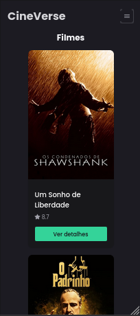
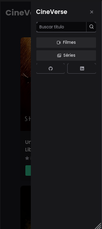
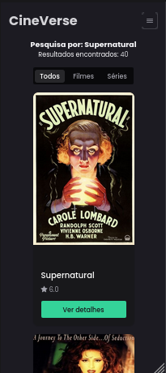
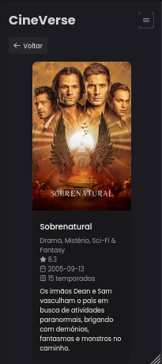
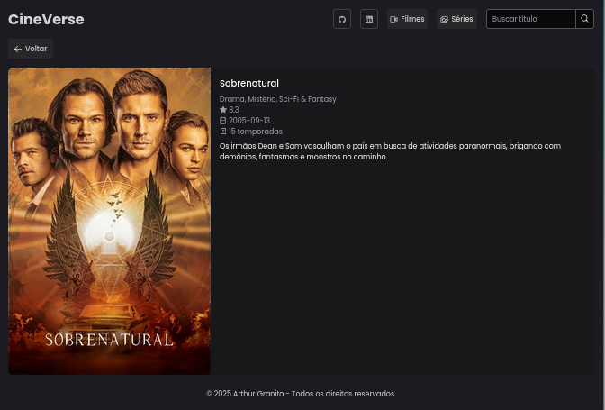

# CineVerse

 <!-- Substitua pelo link do print principal -->

CineVerse é um site desenvolvido com Vue.js que consome a API do TMDB para exibir informações sobre filmes e séries.
Os usuários podem buscar títulos específicos, visualizar detalhes das produções e navegar entre diferentes categorias.

## 🔗 Link do Deploy

[CineVerse Online](https://cineverse-zeta.vercel.app)

## 🚀 Funcionalidades

- 🔍 Pesquisa por filmes e séries
- 🎬 Exibição de informações detalhadas dos títulos
- 📌 Listagem de filmes e séries populares
- 📺 Navegação entre diferentes categorias

## 🛠 Tecnologias Utilizadas

- **Vue.js** - Framework principal
- **PrimeVue** - Biblioteca de componentes UI
- **Vue Router** - Gerenciamento de rotas
- **TMDB API** - Fonte de dados sobre filmes e séries
- **Vercel** - Hospedagem do projeto

## 🖥 Prints

<div style="display: flex; gap: 35px;">






</div>

## ⚙️ Como Rodar o Projeto Localmente

1. Clone o repositório:
   ```sh
   git clone https://github.com/seu-usuario/cineverse.git
   ```
2. Acesse a pasta do projeto:
   ```sh
   cd cineverse
   ```
3. Instale as dependências:
   ```sh
   npm install
   ```
4. Crie um arquivo `.env` na raiz do projeto e adicione sua chave da API do TMDB:
   ```sh
   VITE_TMDB_API_KEY=SUA_CHAVE_AQUI
   ```
5. Inicie o servidor de desenvolvimento:
   ```sh
   npm run dev
   ```
6. Acesse no navegador:
   ```
   http://localhost:5173
   ```

## 🤝 Contribuição

Sinta-se à vontade para abrir issues ou fazer pull requests para melhorias no projeto!

## 📜 Licença

Este projeto é licenciado sob a [MIT License](LICENSE).
